# Moving Day Chaos 🛋️📦

> **الحالة: المرحلة 1 — النموذج الأولي للفيزياء (لاعب واحد).** شخصية بيدين فيزيائيتين، مسك/حمل/لف العفش، قطع هشة تنكسر،
> بيت من غرفتين وشاحنة، مؤقت ونجوم. السؤال اللي نختبره: **هل حمل العفش ممتع ومضحك؟**
> **Status: Phase 1 — single-player physics prototype** (Godot 4.7 + Jolt). See "Play the prototype" below.

## الفكرة باختصار
لعبة جماعية فوضوية بفيزياء مضحكة لـ 1–4 لاعبين أونلاين على Steam: أنت وأصحابك عمّال شركة نقل عفش، لازم تنقلون أثاث بيت كامل للشاحنة قبل ما يخلص الوقت… والكنبة ما تبغى تطلع من الباب، والتلفزيون على وشك يطيح.

A 1–4 player online co-op physics party game: you and your friends are movers who must get a whole
home's furniture into the truck before time runs out — through narrow stairs, tight doors and your
friends' "help".

| | |
|---|---|
| **التصنيف / Genre** | Co-op physics party · Simulation · Comedy |
| **المنصة / Platform** | Steam (Windows, Steam Deck) — later consoles via publisher |
| **اللاعبين / Players** | 1–4 online (Steam lobbies) + Steam Remote Play Together |
| **المحرك / Engine** | Godot 4.7 + GodotSteam |
| **الستايل / Style** | Stylized low-poly 3D, bright colors, third-person |
| **السعر / Price** | $5.99 + 4-pack "Moving Crew" bundle |
| **مدة التطوير / Scope** | MVP ~8–10 weeks, Early Access ~4–6 months |

## جرّب النموذج / Play the prototype
افتح المجلد في Godot 4.7 واضغط Play (أو `godot --path .`).

| التحكم | Keyboard + mouse | Gamepad |
|---|---|---|
| حركة / Move | WASD | Left stick |
| توجيه الأيدي والكاميرا / Aim arms + camera (انظر لتحت عشان توصل للأرض) | Mouse | Right stick |
| مسك يد يسرى / يمنى — Grab left / right (hold) | LMB / RMB | LT / RT |
| مسك بالاثنتين / Grab both | F | — |
| لف القطعة / Spin held item | Q / E | LB / RB |
| قفز / Jump | Space | A |
| إيقاف / Pause | Esc | Start |

**📱 Android:** كل push على `main` يبني APK تلقائياً (GitHub Actions ← *Android build*) وينشره في
[Releases → android-latest](https://github.com/karmontal/moving-day-chaos/releases/tag/android-latest).
افتح الرابط من الجوال، نزّل `moving-day-chaos.apk` وثبّته (اسمح بالتثبيت من مصادر غير معروفة).
التحكم باللمس: اليسار للحركة، اسحب في اليمين لتنظر وترفع/تنزل الأيدي، وأزرار **امسك / يسرى / يمنى** تشتغل بالضغط مرة للمسك ومرة للإفلات.
> النسخة موقّعة بمفتاح تجريبي (`tools/android/debug.keystore`). قبل Google Play لازم مفتاح رفع خاص يُحفظ في Secrets.

**👥 أونلاين (المرحلة 2 — بدأت):** من القائمة ← **العب أونلاين** ← واحد يفتح غرفة والباقي يشوفونها تلقائياً
لو على نفس الواي فاي (أو يدخلوا بالـ IP اللي يظهر عند المضيف). كل لاعب يختار شخصية (ما تتكرر)، والمضيف يبدأ.
المضيف يشغّل الفيزياء كلها ويبعث لقطات ~30 مرة بالثانية؛ الباقي يبعثون حركتهم فقط. شغّال بين الكمبيوتر والأندرويد.
اختبار آلي: `tools/net_test.sh` يشغّل مضيف ولاعب على نفس الجهاز ويتأكد إن الحركة توصل للطرفين.

- كل يد لها قوة محدودة: الكنبة (70 كغ) تحتاج **لاعبين**؛ لما تلعب لوحدك يديك أقوى ×1.75 (`data/game.json` → `solo_strength`).
- القطع الهشة (التلفزيون، الأباجورة، النبتة) تنكسر من أول ضربة قوية؛ الكراتين والكراسي "تنبعج" وتقل قيمتها.
- القطعة تنحسب محمّلة لما تستقر داخل الشاحنة (المنطقة الصفراء). الكنبة ما تطلع من الباب الأمامي إلا إذا لفّيتها.

| | |
|---|---|
| 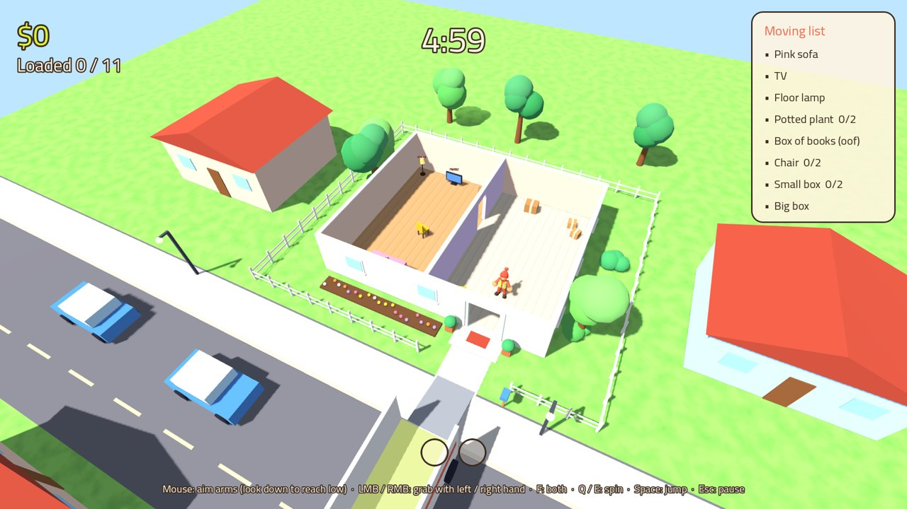 | 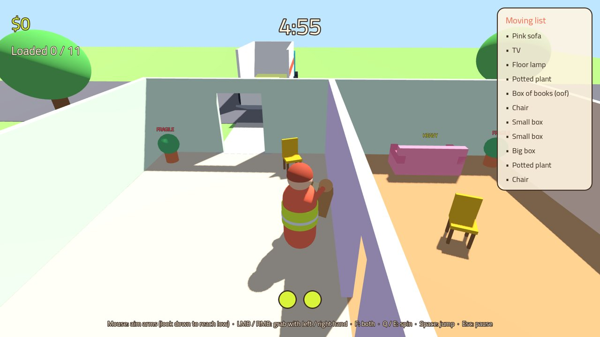 |
| 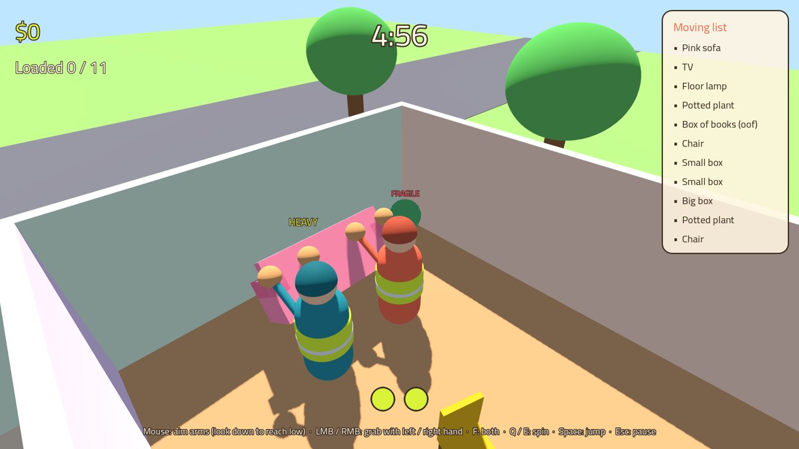 | 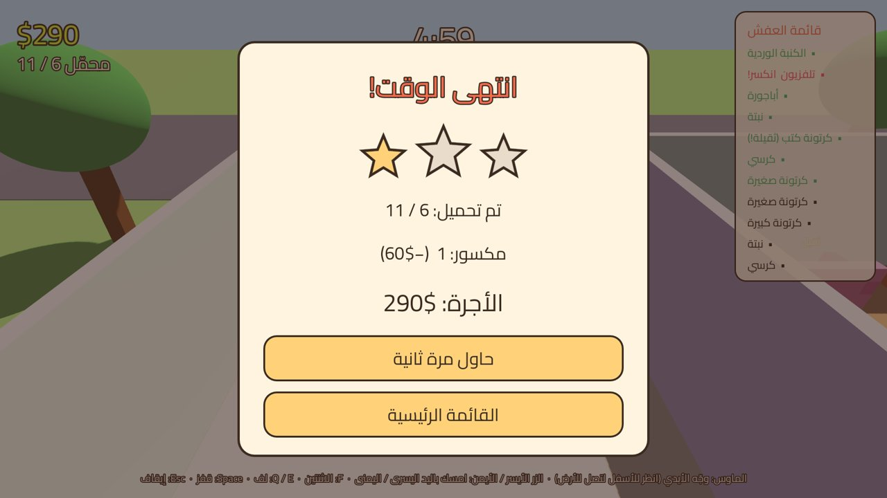 |
| 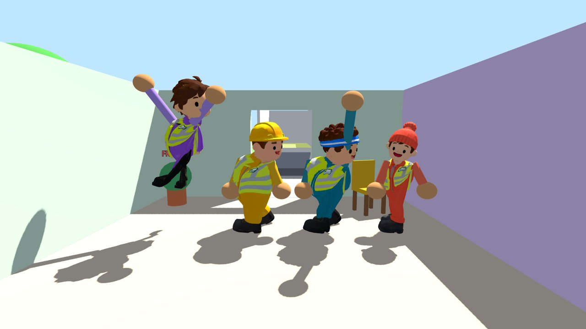 | 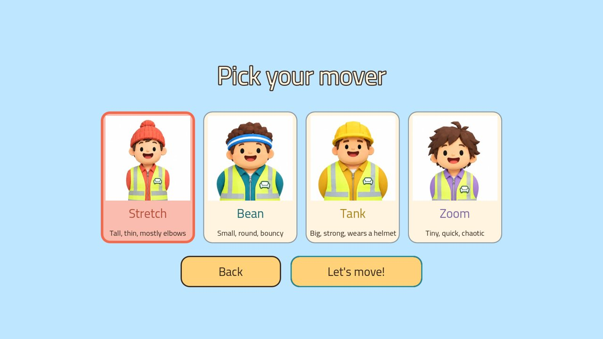 |
| 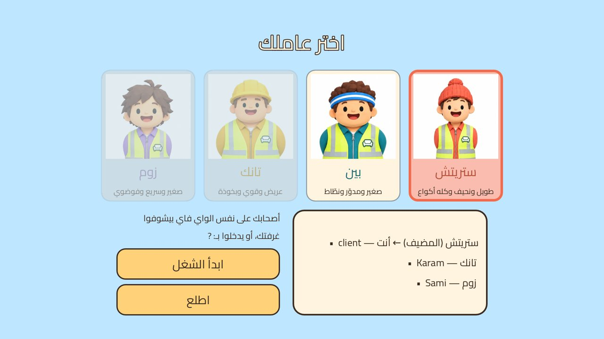 | |

**الاختبارات / Tests:** `godot --headless --path . res://tests/test_runner.tscn`
**الصور / Screenshots:** `xvfb-run -s "-screen 0 1920x1080x24" godot --path . --rendering-driver opengl3 res://tools/screenshot.tscn -- mission out.png`

## التوثيق / Documentation
| الملف | المحتوى |
|---|---|
| [`docs/GDD.md`](docs/GDD.md) | وثيقة تصميم اللعبة: الحلقة الأساسية، الميكانيكيات، المحتوى، التقدّم |
| [`docs/ART_DIRECTION.md`](docs/ART_DIRECTION.md) | الستايل البصري، الألوان، المراجع، الأصول، برومبتات Higgsfield |
| [`docs/TECH_DESIGN.md`](docs/TECH_DESIGN.md) | Technical design: networking, physics sync, grab system, architecture, tests |
| [`docs/MARKET.md`](docs/MARKET.md) | السوق والمنافسين والتسعير وخطة الـ Wishlists |
| [`docs/ROADMAP.md`](docs/ROADMAP.md) | المراحل من النموذج الأولي إلى الإطلاق |
| [`concept/`](concept) | الصور المبدئية (Higgsfield) مع وصف كل صورة |

## الصور المبدئية / Concept art
| | |
|---|---|
| 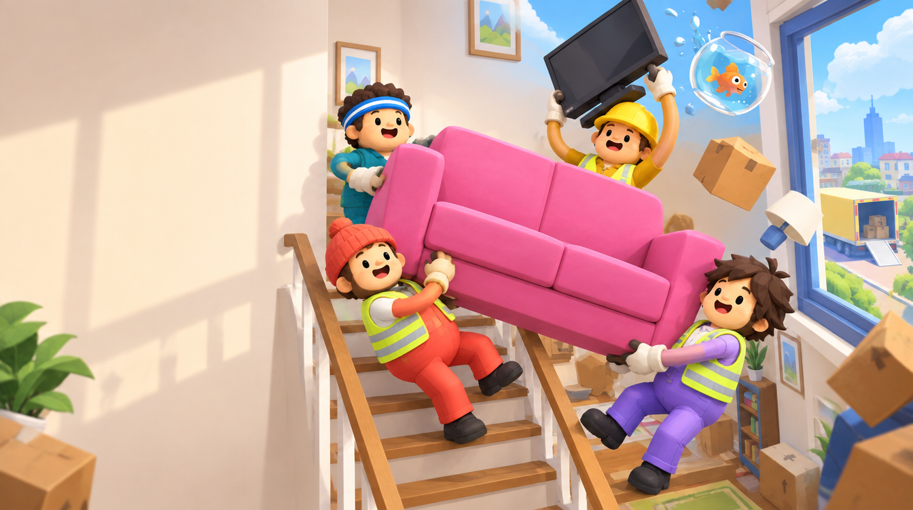 | 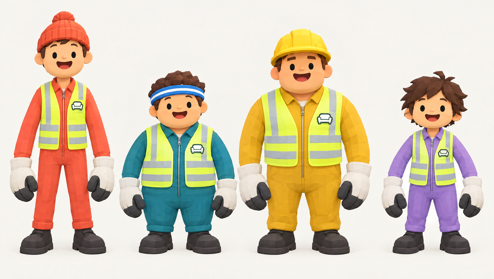 |
| 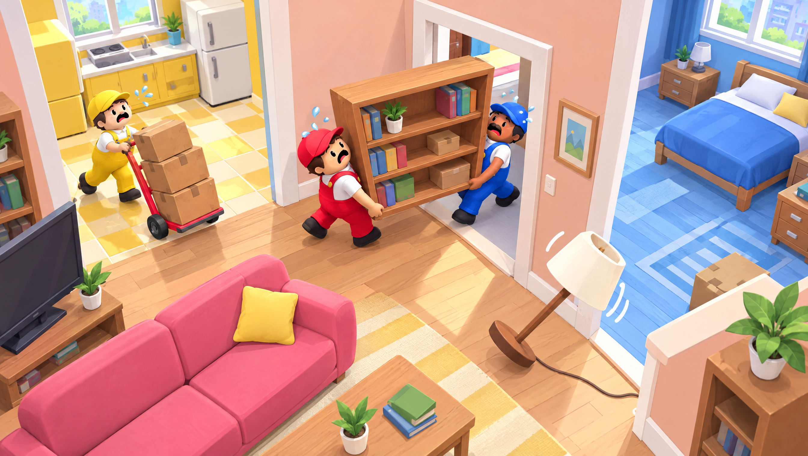 | 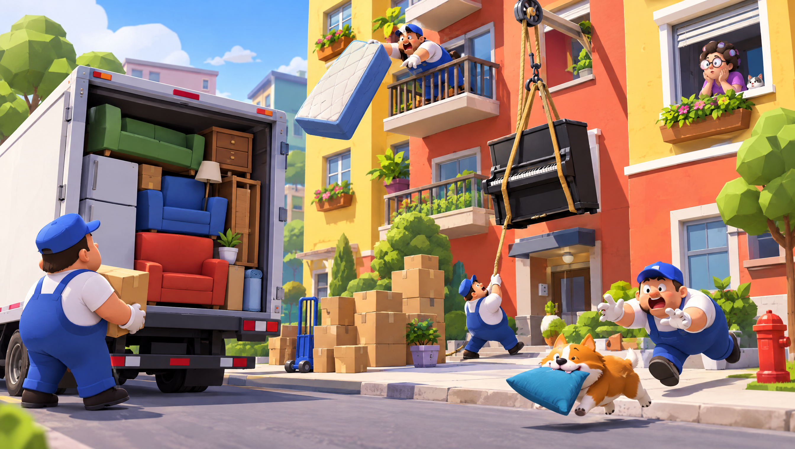 |

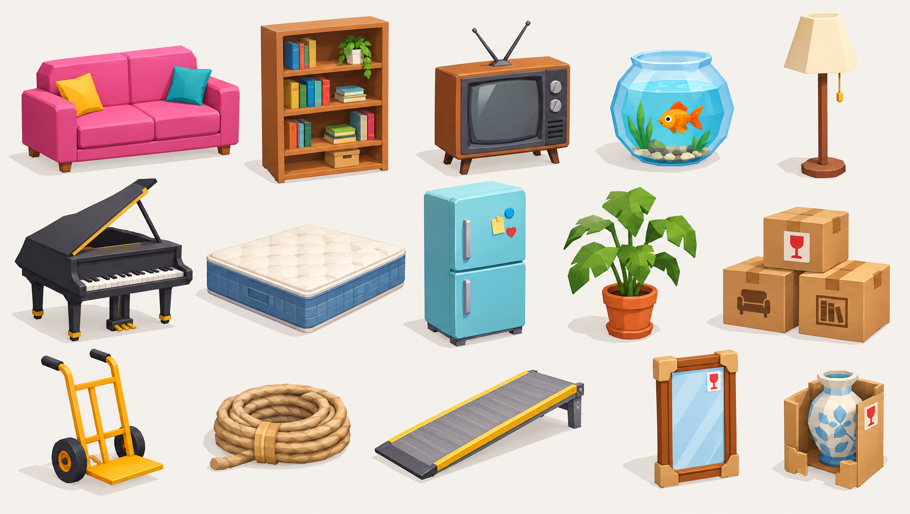
