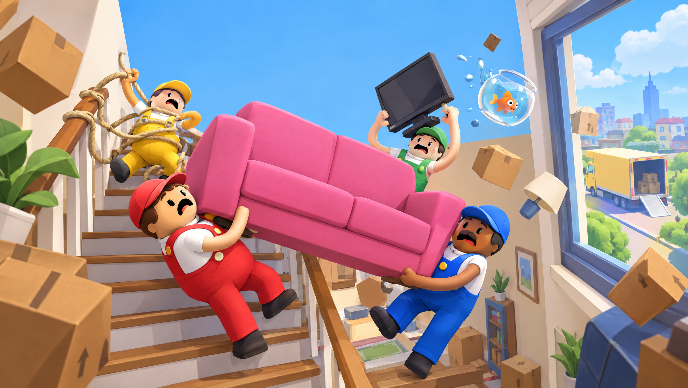

# Moving Day Chaos 🛋️📦

> **الحالة: مرحلة ما قبل الإنتاج (Pre-production)** — المستودع فيه الوصف والتوثيق والصور المبدئية فقط. ما فيه كود بعد.
> **Status: pre-production** — design docs and concept art only. No game code yet.

## الفكرة باختصار
لعبة جماعية فوضوية بفيزياء مضحكة لـ 1–4 لاعبين أونلاين على Steam: أنت وأصحابك عمّال شركة نقل عفش، لازم تنقلون أثاث بيت كامل للشاحنة قبل ما يخلص الوقت… والكنبة ما تبغى تطلع من الباب، والتلفزيون على وشك يطيح.

A 1–4 player online co-op physics party game: you and your friends are movers who must get a whole
home's furniture into the truck before time runs out — through narrow stairs, tight doors and your
friends' "help".

| | |
|---|---|
| **التصنيف / Genre** | Co-op physics party · Simulation · Comedy |
| **المنصة / Platform** | Steam (Windows, Steam Deck) — later consoles via publisher |
| **اللاعبين / Players** | 1–4 online (Steam lobbies) + Steam Remote Play Together |
| **المحرك / Engine** | Godot 4.7 + GodotSteam |
| **الستايل / Style** | Stylized low-poly 3D, bright colors, third-person |
| **السعر / Price** | $5.99 + 4-pack "Moving Crew" bundle |
| **مدة التطوير / Scope** | MVP ~8–10 weeks, Early Access ~4–6 months |

## التوثيق / Documentation
| الملف | المحتوى |
|---|---|
| [`docs/GDD.md`](docs/GDD.md) | وثيقة تصميم اللعبة: الحلقة الأساسية، الميكانيكيات، المحتوى، التقدّم |
| [`docs/ART_DIRECTION.md`](docs/ART_DIRECTION.md) | الستايل البصري، الألوان، المراجع، الأصول، برومبتات Higgsfield |
| [`docs/TECH_DESIGN.md`](docs/TECH_DESIGN.md) | Technical design: networking, physics sync, grab system, architecture, tests |
| [`docs/MARKET.md`](docs/MARKET.md) | السوق والمنافسين والتسعير وخطة الـ Wishlists |
| [`docs/ROADMAP.md`](docs/ROADMAP.md) | المراحل من النموذج الأولي إلى الإطلاق |
| [`concept/`](concept) | الصور المبدئية (Higgsfield) مع وصف كل صورة |

## الصور المبدئية / Concept art
| | |
|---|---|
|  |  |
|  |  |

